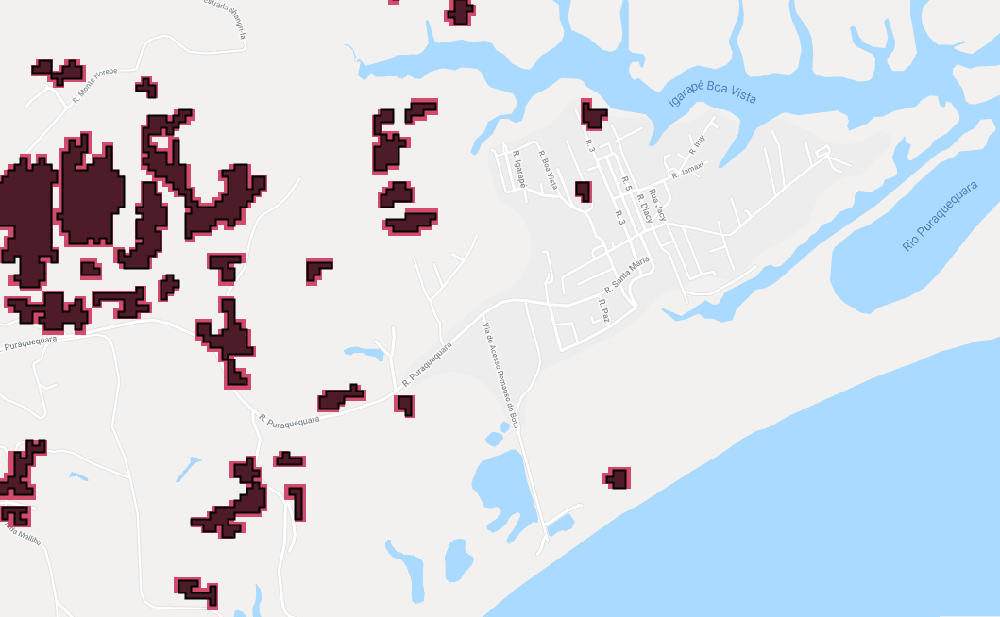

# Rasterization process
Report created to keep documented all processes and results on convertion of Mat Fagan regeneration polygon to raster layer.  

- [X] Converted the Fagan polygons to raster:
    - [X] Is that at 30m resolution?
        - Knowing regeneration data came from hansen data, I set the same resolution and projection;   
    - [X] What projection are you using for this analysis?   
        - EPSG: 4326  

After the convertio process were noticed that the image pixels were a little bigger than the polygon data, as shown in the image below:  
  

* [Layer available here](https://code.earthengine.google.com/?asset=users/HotSpotRestoration/PotentialNaturalRegeneration/RegenerationRaster)  
* [Code available here](https://code.earthengine.google.com/bf422ed27e51afc83e41b0744b7c2666)